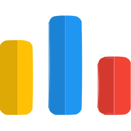

  

  <!-- Typing SVG -->
  

<!-- Social icons section -->

  
  &#8287;&#8287;&#8287;&#8287;&#8287;
  
  &#8287;&#8287;&#8287;&#8287;&#8287;
  
  &#8287;&#8287;&#8287;&#8287;&#8287;
  <!-- <a href="https://discordapp.com/users/740442954765959240" alt="Web" title="Personal Website"> -->
  
  <!-- </a> -->
  &#8287;&#8287;&#8287;&#8287;&#8287;
  
  &#8287;&#8287;&#8287;&#8287;&#8287;
  

 

<!-- Social badges section -->

  
  

  🤝 Feel free to connect with me through the above platforms for any collaboration or project discussions!

 
  
<h2>🎓 Education</h2>

  
  

    Fourth Year B.Tech Student Pursuing Electronics & Communication Engineering at IIIT Hyderabad
  

 
  
<h2>📘 My Top Projects</h2>

  <!-- Small repo cards - https://github.com/DenverCoder1/github-readme-stats -->
  

    
    
    
    
    
    
  

   
  
    

 
  
<h2>🛠️ My Favorite Tools</h2>

  <!-- Badges are from https://github.com/Ileriayo/markdown-badges -->

  <h3>👨‍💻 Programming and Markup Languages</h3>

  

      
      
      
      
      
      
      
      
      
      
      
  

  <h3>🧰 Frameworks and Libraries</h3>

  

      
      
      
      
      
      
      
      
      
      
      
      
      
      
      
      
      
      
      
      
      
      
      
      
  

  <h3>🗄️ Databases and Cloud Hosting</h3>

  

      
      
      
      
      
  

  <h3>💻 Software and Tools</h3>

  

      
      
      
      
      
      
      
      
      
      
      
      
      
      
      
      
      
      
  

  <h3>💬 Learning and Coding Platforms</h3>

  

      
      
      
      
      
      
      
      
      
      
      
      
      
  

<h2>📕 Top Projects I've Contributed To</h2>

<!-- Example for future projects -->

<!--  
 --> 
<!--  
 --> 
<!--    --> 
<!-- <a href="https://github.com/DenverCoderOne/My-Contributions/blob/main/README.md"> -->
<!--  <a href="#"> --> 
<!--   --> 
<!--  </a> --> 
<!--     --> 

 
  
<h2>📊 Github Stats and Activity</h2>

  <h3>🔥 Streak Stats</h3>

  <!-- GitHub Readme Streak Stats - https://github.com/DenverCoder1/github-readme-streak-stats -->
  

      
  

  <h3>💻 GitHub Profile Stats</h3>

  <!-- https://github.com/anuraghazra/github-readme-stats -->

  
  
   

  <h6> <b>Note:</b> "Most Used Languages" is only a metric of the languages my public code consists of and doesn't reflect experience or skill level.</h6> 
  
  <!-- https://github.com/ashutosh00710/github-readme-activity-graph -->

  

  <!-- <h3>⚡ Recent GitHub Activity</h3> -->

  <!-- https://github.com/jamesgeorge007/github-activity-readme -->
  <!--START_SECTION:activity-->

  <!--END_SECTION:activity-->

<!---
Ashish-Chokhani/Ashish-Chokhani is a ✨ special ✨ repository because its `README.md` (this file) appears on your GitHub profile.
You can click the Preview link to take a look at your changes.
--->

